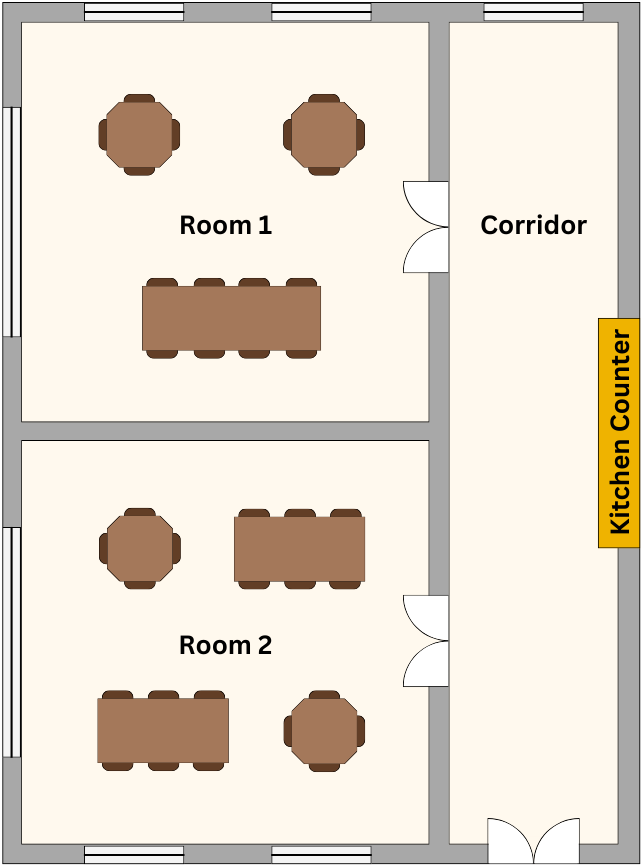
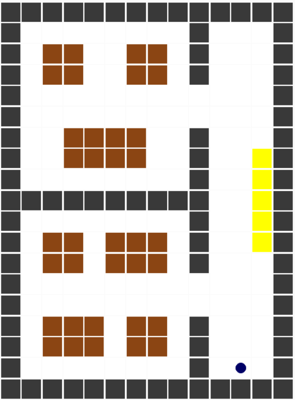

# Multi-Target-Robot-Navigation-with-Double-DQN

This project involves the development and evaluation of a reinforcement learning-based autonomous delivery robot functioning as a waiter in a restaurant setting. The robot's tasks include picking up plates from the kitchen, navigating the restaurant environment, and delivering food to designated tables. This project builds on the previous assignment, incorporating more complex environments and advanced RL techniques.

<div style="text-align: center;">
    
    
</div>

## Project Structure

```
├── agents/
│   ├── ddqn_agent.py
│   ├── q_learning_agent.py
├── grid_configs/
│   ├── example_grid.npy
│   ├── restA_1r.npy
│   ├── restA_2r.npy
├── world/
│   ├── __init__.py
│   ├── environment.py
│   ├── grid.py
│   ├── grid_creator.py
│   ├── gui.py
│   ├── helpers.py
│   ├── path_visualizer.py
│   ├── static/
│   ├── templates/
├── train.py
├── requirements.txt
├── utils.py
├── dqn.py
└── README.md

```

## Setup

1. **Install the dependencies**:
   ```sh
   pip install -r requirements.txt
   ```

## Usage

To train the reinforcement learning agents, use the `train.py` script. This script requires certain arguments to specify the agent type, grid configuration, and other parameters.

### Running the Training Script

```sh
python train.py <grid_config> --agent <agent_type> [other_options]
```

### Command-Line Options

- `--agent_type`: Specify the type of agent to train (default `ddqn`)(`ddqn`, `qlearning`).
- `GRID`: Paths to the grid file to use. There can be more than one. (e.g., `grid_configs/restaurant_single_room.npy`).
- `--no_gui`: Disables rendering to train faster.
- `--sigma`: Sigma value for the stochasticity of the environment (default 0.1).
- `--fps`: Frames per second to render at. Only used if no_gui is not set (default 30).
- `--random_seed`: Random seed value for the environment (default 0).
- `--train_iter`: Number of training iterations to go through(default 1000).
- `--eval_iter`: Number of evaluation iterations to go through(default 0.1).
- `--load_model_path`: Path to a pre-trained model to load.
- `--trainable`: If the agent should continue training or not(default True).
- `--capacity`: Number of plates an agent can carry at a time(default 3).
- `--experiment_name`: Optional experiment name(default None)().
- `--early_stopping_threshold`: Number of iterations needed to stop after no improvement observed.(default 100).
- `--start_epsilon`: Initial value for epsilon.(default 0.8).
- `--hyperparameter_tuning`: If set, perform a hyperparameter tuning.

### Example

```sh
python train.py grid_configs/restA_1r.npy --train_iter 100 --n_plates 7 --fps 30 --sigma 0.1 --eval_iter 10 --random_seed 5 --agent_type ddqn --start_epsilon 0.7
```

## File Descriptions

- **agents/**: Contains the implementation of different RL agents.
  - `ddqn_agent.py`: Implementation of the Double Deep Q-Learning agent.
  - `q_learning_agent.py`: Implementation of the Q-Learning agent.
- **grid_configs/**: Various grid configuration files used for training and testing the agents.
- **world/**: Contains the environment setup and helper functions for running the simulations.
  - `environment.py`: Defines the environment in which the agents operate.
  - `grid.py`: Manages grid configurations and operations.
  - `grid_creator.py`: Utility for creating new grid configurations.
  - `gui.py`: Handles the graphical user interface for visualizing the environment.
  - `helpers.py`: Helper functions used across the project.
  - `path_visualizer.py`: Visualizes the paths taken by the agents.
- `utils.py`: Contains utility functions used across the project.
- `dqn.py`: Implementation of Deep Q-Network specific functionalities.
- `train.py`: Script to train the reinforcement learning agents.

## Environment Design

The environment is modeled as a grid-based representation of a restaurant, comprising walls, floors, tables, and the kitchen. The robot must navigate this environment to perform its tasks efficiently. The grid can be adjusted to simulate different restaurant layouts, including single-room and dual-room scenarios connected by a door.

## Experiment commands

- Hyperparameter tuning (warning, takes 2 hours to run)

```sh
python train.py grid_configs/restA_1r.npy --hyperparameter_tuning --no_gui
```

- Grid comparison
  1-room agent:

```sh
python train.py grid_configs/restA_1r.npy --train_iter 1000 --n_plates 9 --capacity 3 --eval_iter 100 --agent_type ddqn --start_epsilon 0.4 --early_stopping_threshold 100 --no_gui
```

2-room agent

```sh
python train.py grid_configs/restA_2r.npy --train_iter 1300 --n_plates 9 --capacity 3 --eval_iter 100 --agent_type ddqn --start_epsilon 0.5 --early_stopping_threshold 200 --no_gui
```

- Q-learning vs DDQN
  1-room agent

```sh
python train.py grid_configs/restA_1r.npy --train_iter 1000 --n_plates 9 --capacity 3 --eval_iter 100 --agent_type qlearning --start_epsilon 0.8 --early_stopping_threshold 100 --no_gui
```

2-room agent

```sh
python train.py grid_configs/restA_1r.npy --train_iter 1000 --n_plates 9 --capacity 3 --eval_iter 100 --agent_type qlearning --start_epsilon 0.8 --early_stopping_threshold 200 --no_gui
```

- Varying agent capacity
  Capacity = 1

```sh
python train.py grid_configs/restA_1r.npy --train_iter 1000 --n_plates 9 --capacity 1 --eval_iter 100 --agent_type ddqn --start_epsilon 0.5 --early_stopping_threshold 100 --no_gui
```

Capacity = 3

```sh
python train.py grid_configs/restA_1r.npy --train_iter 1000 --n_plates 9 --capacity 3 --eval_iter 100 --agent_type ddqn --start_epsilon 0.5 --early_stopping_threshold 100 --no_gui
```

Capacity = 5

```sh
python train.py grid_configs/restA_1r.npy --train_iter 1000 --n_plates 9 --capacity 5 --eval_iter 100 --agent_type ddqn --start_epsilon 0.5 --early_stopping_threshold 100 --no_gui
```

## Conclusion

In this project, we designed and evaluated an autonomous delivery robot using reinforcement learning techniques. We implemented both Q-Learning and Double Deep Q-Learning (DDQN) agents and tested their performance in various restaurant environments. Our results demonstrated that the DDQN agent significantly outperformed the Q-Learning agent, particularly in complex environments.

## Future Work

- Experiment with more complex environments.
- Integrate battery management for autonomous recharging.
- Investigate multi-agent coordination.
- Explore direct customer delivery scenarios.

## References

- A. Faust et al., "Automated aerial suspended cargo delivery through reinforcement learning," Artificial Intelligence, 2017.
- M. Hossain, "Autonomous delivery robots: A literature review," IEEE Engineering Management Review, 2023.
- H. Jahanshahi et al., "A deep reinforcement learning approach for the meal delivery problem," Knowledge-Based Systems, 2022.
- Y. Li, "Deep reinforcement learning: An overview," arXiv preprint arXiv:1701.07274, 2017.

## Contributors

- Gallé Koen
- Möller Chandiramani Annika
- Huijten Patrick
- Mostajeran Gourtani Aria
- Mainardi Luca
- Sendin Martin Cristobal
- Mihalachi Andrei

---
